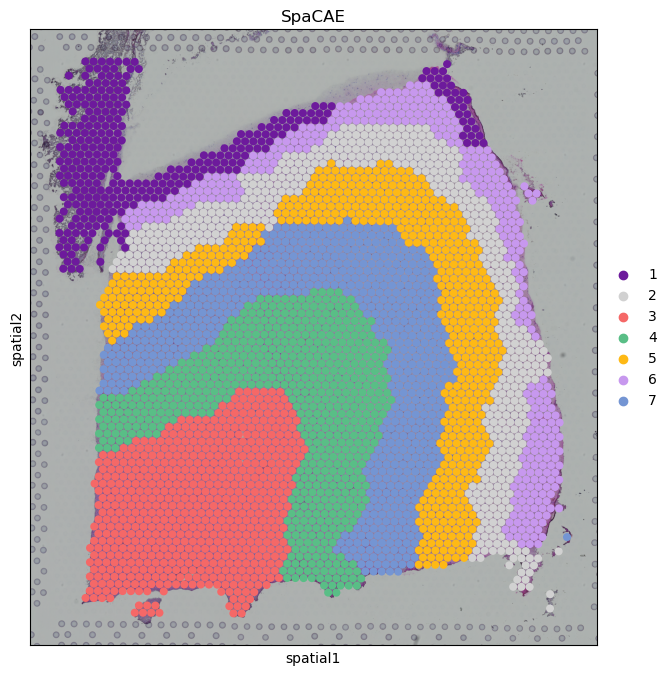
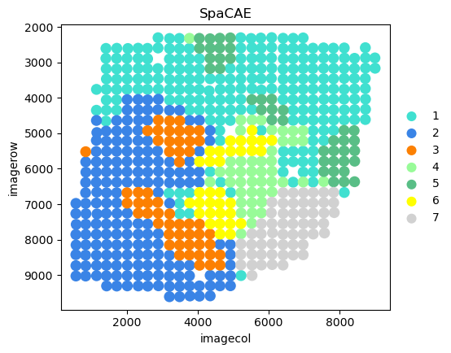

<h1><center>SpaCAE Tutorial</center></h1>


### Outline
Tutorial 1: 10x Visium (DLPFC dataset)<br>
Tutorial 2: ST data (HER2-positive breast cancer)<br>

### Tutorial 1: 10x Visium (DLPFC dataset)
Here, we reapply SpaCAE onto the 151675 slice of human dorsolateral prefrontal cortex (DLPFC) to demonstrates the identification of spatial domains on 10x Visium data. 
The human dorsolateral prefrontal cortex (DLPFC) datasets are available in the spatialLIBD package at http://spatial.libd.org/spatialLIBD. To run SpaCAE analysis, we first download `model.py`, `utils.py`, and `SpaCAE.py` from https://github.com/HYF01/SpaCAE/tree/main/SpaCAE.

1. Import python modules


```python
import os
import scanpy as sc
import pandas as pd
from sklearn.metrics import adjusted_rand_score, normalized_mutual_info_score
```


```python
# the location of R (used for the mclust clustering)
os.environ['R_HOME'] = 'E:\\R\\R-4.2.2'
os.environ['R_USER'] = 'E:\\environment2023\\Anaconda3\\envs\\ae38\\Lib\\site-packages\\rpy2'
```

  2. Read in data


```python
myadata = sc.read_visium('151675')
myadata.var_names_make_unique()
sc.pp.highly_variable_genes(myadata, n_top_genes=2000, flavor='seurat_v3')
```

    E:\environment2023\Anaconda3\envs\stlearn\lib\site-packages\anndata\_core\anndata.py:1830: UserWarning: Variable names are not unique. To make them unique, call `.var_names_make_unique`.
      utils.warn_names_duplicates("var")
    


```python
myadata
```


    AnnData object with n_obs × n_vars = 3592 × 33538
        obs: 'in_tissue', 'array_row', 'array_col'
        var: 'gene_ids', 'feature_types', 'genome', 'highly_variable', 'highly_variable_rank', 'means', 'variances', 'variances_norm'
        uns: 'spatial', 'hvg'
        obsm: 'spatial'


  3. Load SpaCAE model


```python
from SpaCAE import SpaCAE
```


```python
myspacae = SpaCAE(adata=myadata, num_cluster=7)
```

  4. Expression matrix standardization and data augmentation<br>
  `stg` is the constructed spot adjacency graph, `oridata` and `augdata` are the original gene expression matrix and augmented gene expression matrix respectively.


```python
n_adata, oridata, augdata, stg = myspacae.load_data()
```

    1/3.Starting loading data...
    The data was successfully loaded and the graph constructed
    


```python
n_adata
```


    AnnData object with n_obs × n_vars = 3592 × 33538
        obs: 'in_tissue', 'array_row', 'array_col'
        var: 'gene_ids', 'feature_types', 'genome', 'highly_variable', 'highly_variable_rank', 'means', 'variances', 'variances_norm'
        uns: 'spatial', 'hvg', 'log1p', 'pca', 'spatial_reconstruction'
        obsm: 'spatial'
        varm: 'PCs'
        layers: 'counts', 'log1p-ori', 'log1p-aug'


  5. Model training <br>
  `z_ori` and `z_aug` are latent representations used to identify spatial domains.


```python
z_ori, z_aug, xhat_ori, xhat_aug = myspacae.train_SpaCAE(oridata, augdata, stg)
```

    2/3.Starting training...
    

    loss=8.171182632446289: 100%|███████████████████████████████████████████████████| 40000/40000 [02:14<00:00, 297.52it/s]
    

    Successful completion of training
    

  6. Identify spatial domains using Mclust algorithms.<br>


```python
c_adata = myspacae.cluster(n_adata, z_ori)
```

    3/3.Starting clusting...
    

    R[write to console]:                    __           __ 
       ____ ___  _____/ /_  _______/ /_
      / __ `__ \/ ___/ / / / / ___/ __/
     / / / / / / /__/ / /_/ (__  ) /_  
    /_/ /_/ /_/\___/_/\__,_/____/\__/   version 6.0.1
    Type 'citation("mclust")' for citing this R package in publications.
    
    

    fitting ...
      |======================================================================| 100%
    


```python
c_adata.obs['spacae_clust']
```


    AAACAACGAATAGTTC-1    1
    AAACAAGTATCTCCCA-1    5
    AAACACCAATAACTGC-1    3
    AAACAGAGCGACTCCT-1    2
    AAACAGGGTCTATATT-1    4
                         ..
    TTGTTGTGTGTCAAGA-1    7
    TTGTTTCACATCCAGG-1    3
    TTGTTTCATTAGTCTA-1    3
    TTGTTTCCATACAACT-1    4
    TTGTTTGTATTACACG-1    3
    Name: spacae_clust, Length: 3592, dtype: category
    Categories (7, object): ['1', '2', '3', '4', '5', '6', '7']


  7. Spatial domain visualization.<br>


```python
myspacae.plot_domain(c_adata)
```


    

    


```python
# read the annotation
GT_meta = pd.read_csv('151675/metadata.tsv', sep='\t')
GT_meta['SpaCAE'] = c_adata.obs["spacae_clust"].tolist()
GT_meta = GT_meta[~pd.isnull(GT_meta['layer_guess'])]
ARI = adjusted_rand_score(GT_meta['layer_guess'], GT_meta['SpaCAE'])
NMI = normalized_mutual_info_score(GT_meta['layer_guess'], GT_meta['SpaCAE'])
```


```python
ARI,NMI
```


    (0.6862745935442799, 0.7571973396616536)


### Tutorial 2: ST data (HER2-positive breast cancer)
We demonstrate the capacity of SpaCAE on cancer tissue. 
The HER2-positive breast tumor data from ST platform is available at https://github.com/almaan/her2st.

1. Import python modules


```python
import os
import scanpy as sc
import pandas as pd
import stlearn as st
import numpy as np
```


```python
# the location of R (used for the mclust clustering)
os.environ['R_HOME'] = 'E:\\R\\R-4.2.2'
os.environ['R_USER'] = 'E:\\environment2023\\Anaconda3\\envs\\ae38\\Lib\\site-packages\\rpy2'
```

  2. Read in data


```python
h2adata = st.ReadOldST(count_matrix_file="H1/H1.tsv/ut_H1_stdata_filtered.tsv",
                     spatial_file="H1/H1_selection.tsv/H1_selection.tsv",
                     image_file="H1/H1.jpg")
h2adata.var_names_make_unique()
sc.pp.highly_variable_genes(h2adata, n_top_genes=2000, flavor='seurat_v3')
```

    Added tissue image to the object!
    


```python
h2adata
```


    AnnData object with n_obs × n_vars = 613 × 14602
        obs: 'imagecol', 'imagerow'
        var: 'highly_variable', 'highly_variable_rank', 'means', 'variances', 'variances_norm'
        uns: 'spatial', 'hvg'
        obsm: 'spatial'


  3. Load SpaCAE model


```python
from SpaCAE import SpaCAE
```


```python
h2spacae = SpaCAE(adata=h2adata,
                  num_cluster=7,
                  input_dim=13,  
                  z_dim=13,
                  output_dim=13,
                  alpha=0.1,
                  n_epochs=10000,
                  )
```

  4. Expression matrix standardization and data augmentation<br>
  `stg` is the constructed spot adjacency graph, `oridata` and `augdata` are the original gene expression matrix and augmented gene expression matrix respectively.


```python
n_adata, oridata, augdata, stg = h2spacae.load_data()
```

    1/3.Starting loading data...
    The data was successfully loaded and the graph constructed
    


```python
n_adata
```


    AnnData object with n_obs × n_vars = 613 × 14602
        obs: 'imagecol', 'imagerow'
        var: 'highly_variable', 'highly_variable_rank', 'means', 'variances', 'variances_norm'
        uns: 'spatial', 'hvg', 'log1p', 'pca', 'spatial_reconstruction'
        obsm: 'spatial'
        varm: 'PCs'
        layers: 'counts', 'log1p-ori', 'log1p-aug'


  5. Model training<br>
  `stg` is the constructed spot adjacency graph, `oridata` and `augdata` are the original gene expression matrix and augmented gene expression matrix respectively.


```python
z_ori, z_aug, xhat_ori, xhat_aug = h2spacae.train_SpaCAE(oridata, augdata, stg)
```

    2/3.Starting training...
    

    loss=1.9115179777145386: 100%|██████████████████████████████████████████████████| 10000/10000 [00:27<00:00, 360.10it/s]
    

    Successful completion of training
    

  6. Identify spatial domains using Mclust algorithms.<br>


```python
c_adata = h2spacae.cluster(n_adata, z_ori)
```

    3/3.Starting clusting...
    

    R[write to console]:                    __           __ 
       ____ ___  _____/ /_  _______/ /_
      / __ `__ \/ ___/ / / / / ___/ __/
     / / / / / / /__/ / /_/ (__  ) /_  
    /_/ /_/ /_/\___/_/\__,_/____/\__/   version 6.0.1
    Type 'citation("mclust")' for citing this R package in publications.
    
    

    fitting ...
      |======================================================================| 100%
    


```python
c_adata.obs['spacae_clust']
```


    10x10    1
    10x11    1
    10x12    1
    10x13    1
    10x14    1
            ..
    9x29     2
    9x30     2
    9x31     2
    9x32     2
    9x33     2
    Name: spacae_clust, Length: 613, dtype: category
    Categories (7, object): ['1', '2', '3', '4', '5', '6', '7']


  7. Spatial domain visualization and the calculation of purity.<br>


```python
allcolour = ["#40E0D0","#3A84E6","#FC8002","#98FB98","#59BE86", "#FFFF00", "#D1D1D1"]
ax = sc.pl.scatter(n_adata,
                   alpha=1,
                   x="imagecol",
                   y="imagerow",
                   color='spacae_clust',
                   title='SpaCAE',
                   palette=allcolour,
                   show=False,
                   size=230000 / n_adata.shape[0])
ax.set_aspect('equal', 'box')
ax.axes.invert_yaxis()
```


    

    


```python
from utils import purity_func

spacae_frame = pd.DataFrame(columns=['spacae', 'imagecol', 'imagerow'])
spacae_frame['spacae'] = n_adata.obs['spacae_clust']
spacae_frame['imagerow'] = n_adata.obs['imagerow']
spacae_frame['imagecol'] = n_adata.obs['imagecol']
spacae_frame.index = range(613)
loc_meta = pd.read_csv('H1/H1_selection.tsv/H1_selection.tsv', sep='\t').iloc[:, 2:6]
loc_meta = loc_meta.rename(columns={"pixel_x": "imagecol", "pixel_y": "imagerow"})
spacae_loc = spacae_frame.merge(loc_meta[['imagerow', 'imagecol', 'new_x', 'new_y']])
spacae_loc = spacae_loc.rename(columns={"new_x": "x", "new_y": "y"})
df_meta = pd.read_csv('H1/H1_labeled_coordinates.tsv', sep='\t')
res = spacae_loc.merge(df_meta[['x', 'y', 'label']])

purity = purity_func(res['spacae'], res['label'])
```


```python
purity
```


    0.6476345840130505


